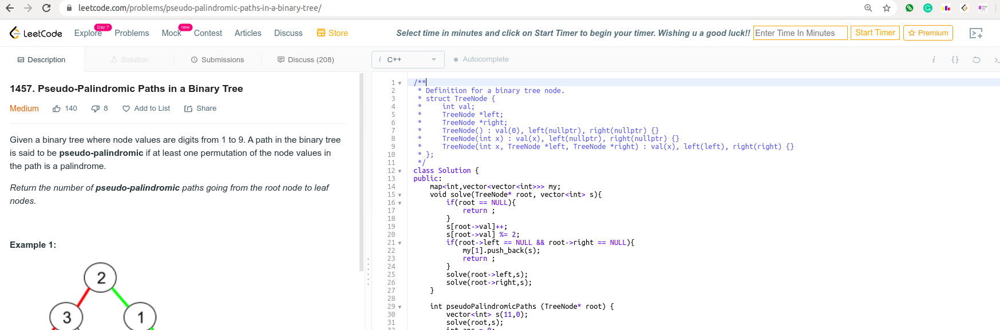

# LeetcodeTimer
A Chrome extension that provides timer for the leetcode questions. Leetcode is a website for interview preprations and most interviews are time bound. This extension can help you get better by improving your speed. 

## Screenshots



## Features
- Go to [leetcode.com](https://leetcode.com/) and open any problem.
- You will see startTimer and custom Input at top in the options bar.
- Set the Time in minutes and click on start timer to begin timer.
- The Timer will get Red when only 1 minute remains.
- You can also refresh the page, this would not affect the timer.

### Installation
```sh
$ git clone https://github.com/rajatkhanna1999/LeetcodeTimer.git
```

### Setup
- Open the Extension Management page by navigating to chrome://extensions.
- The Extension Management page can also be opened by clicking on the Chrome menu, hovering over **More Tools** then selecting **Extensions**.
- Enable Developer Mode by clicking the toggle switch next to **Developer mode**.
- Click the **LOAD UNPACKED** button and select the extension directory.

### License

[](http://badges.mit-license.org)

- **[MIT license](http://opensource.org/licenses/mit-license.php)**
